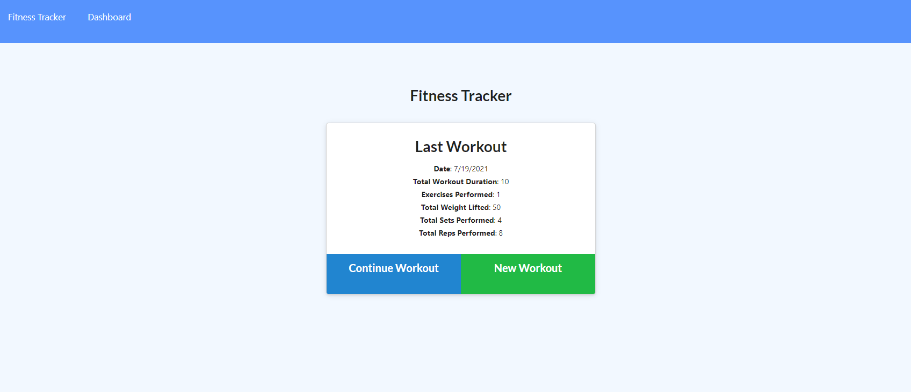
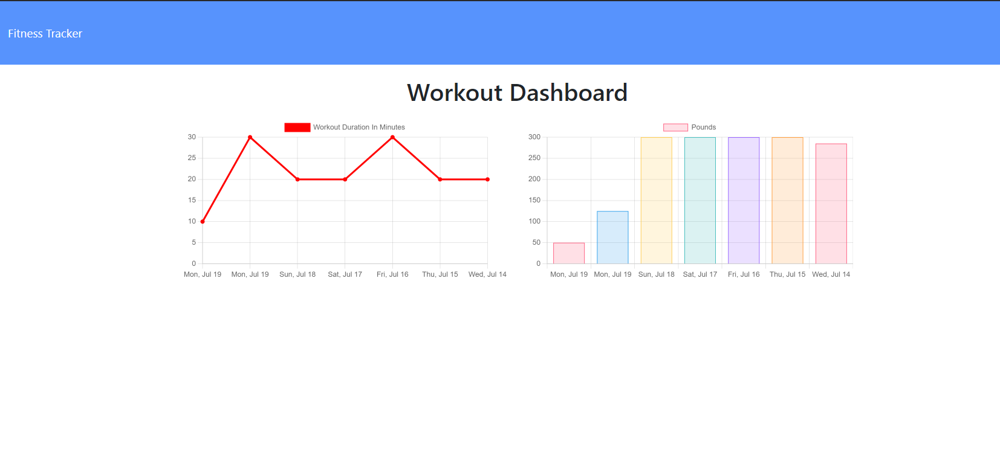

# Fitness Tracker

  ## Table of Contents
  - [Description](#description)
  - [Installation Instructions](#installation-instructions)
  - [Usage Information](#usage-information)
  - [Questions?](#questions)

  ## Description
  This is a simple web app that allows users to track their workouts. You can add multiple workouts to a single exercise session, and view the cumulative workout stats on the dashboard page.
  ## Installation Instructions
  From GitHub: Download the repository from GitHub. Install the required Node modules and start the server. Navigate to the localhost page and begin entering data. From Heroku: Visit https://pacific-lowlands-33435.herokuapp.com/ and start entering your workout stats.
  ## Usage Information
  From GitHub: After booting the server, navigate to the localhost page and begin entering data. From Heroku: Visit https://pacific-lowlands-33435.herokuapp.com/ and start entering your workout stats.

  
 
  ## Questions?
  Find me on github @ gleeson-emily.